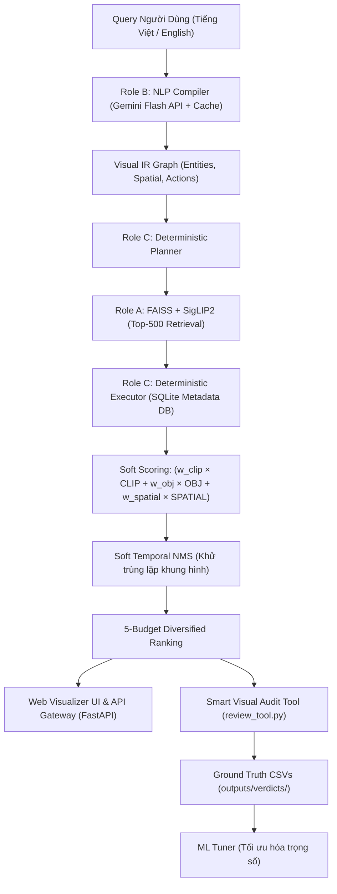

# 🎬 EBT Vision Search 2026 — AI Challenge System

Hệ thống truy xuất khoảnh khắc video đa phương thức (**Multimodal Video Information Retrieval**), trả lời câu hỏi thị giác (**Visual Q&A**) và truy vết chuỗi hành động (**Temporal TRAKE**) được phát triển cho cuộc thi **AI Challenge 2026**.

---

## 🌟 Tính Năng Nổi Bật

* ⚡ **Truy xuất Vector Siêu Tốc (FAISS + SigLIP2):** Tìm kiếm 177,321 khung hình trong < 10ms sử dụng mô hình Google SigLIP2 (768-dim).
* 🧠 **Biên dịch Ngữ nghĩa Tự nhiên (Gemini NLP Engine):** Tự động bóc tách thực thể, quan hệ không gian, hành động và thuộc tính thành đồ thị `VisualIRGraph`.
* 🔍 **Lọc Bounding Box & Quan hệ Không gian (SQLite Cache Engine):** Tra cứu 584 nhãn Faster R-CNN trong ~1.7ms/frame với cơ chế Soft Scoring.
* 🖼️ **Trích xuất ảnh On-Demand (Multi-Strategy Image Resolver):** Hỗ trợ `remotezip` stream dữ liệu thẳng từ Cloud (HTTP Range) siêu tốc mà không cần tốn hàng trăm GB ổ cứng. Đọc trực tiếp ảnh từ file nén `.zip` hoặc trích xuất frame từ video `.mp4`.
* 🤖 **Thẩm định Hình ảnh Chuyên sâu (Gemini VLM Re-ranking):** Tự động gửi các ứng viên khả nghi (ambiguous, điểm thấp) lên Gemini Vision API để xác nhận chéo, tăng độ chính xác mà không đòi hỏi GPU cục bộ.
* 🎯 **Bộ Đánh giá Trực quan 3 Trạng thái (3-State Visual Audit Tool):** Chấm nhanh kết quả bằng phím tắt (`MATCH` ✅, `UNCERTAIN` ⚠️, `MISMATCH` ❌).
* 🤖 **Tự động Tinh chỉnh Trọng số (ML Tuner):** Áp dụng thuật toán tối ưu hóa 3-Tier Ranking Loss tìm bộ tham số `(w_clip, w_obj, w_spatial)` tối ưu.

---

## 🏗️ Kiến Trúc Hệ Thống (4-Role Architecture)



---

## 📁 Cấu Trúc Thư Mục

```text
EBT_Project_2026/
├── api/                        # FastAPI Gateway & Web Visualizer
│   ├── main.py                 # Server entrypoint & Static router
│   ├── routes/
│   │   ├── kis_routes.py       # POST /api/v1/search/kis
│   │   ├── qa_routes.py        # POST /api/v1/search/qa
│   │   ├── trake_routes.py     # POST /api/v1/search/trake
│   │   └── feedback_routes.py  # POST /api/v1/feedback (Ground truth collector)
│   └── static/                 # Giao diện Web Visualizer (HTML/CSS/JS)
├── config/
│   └── config.yaml             # Cấu hình tham số, đường dẫn và trọng số
├── data/
│   ├── raw/                    # Dữ liệu gốc (keyframes, objects, metadata)
│   ├── processed/              # SQLite metadata.db & FAISS index
│   └── zips/                   # Thư mục chứa file nén keyframes_Lxx.zip
├── docs/                       # Tài liệu hướng dẫn & kỹ thuật
│   ├── API_DOCUMENTATION.md    # Tài liệu toàn bộ REST API
│   ├── USER_GUIDE.md           # Hướng dẫn vận hành và chấm bài
│   └── ARCHITECTURE_HANDOVER.md# Bàn giao kỹ thuật & thiết kế chi tiết
├── outputs/
│   ├── reviews/                # File HTML sinh từ Visual Review Tool
│   ├── verdicts/               # File CSV Ground Truth (human_verdict_*.csv)
│   └── tuning_results.json     # Kết quả tối ưu từ ML Tuner
├── src/
│   ├── common/                 # Schemas (CandidateFrame, VisualIRGraph...)
│   ├── role_a_retrieval/       # FAISS VectorSearcher & Feature Store
│   ├── role_b_nlp/             # Gemini NLP Compiler & Normalizer
│   └── role_c_logic/           # Capability Registry, Planner, Executor & Ranking
├── tools/
│   ├── review_tool.py          # Interactive Visual Audit & Web HTML Generator
│   └── ml_tuner.py             # 3-Tier Loss ML Hyperparameter Tuner
├── .env.example                # Khai báo mẫu biến môi trường
├── requirements.txt            # Thư viện phụ thuộc
└── README.md                   # Tài liệu tổng quan
```

---

## 🚀 Hướng Dẫn Cài Đặt & Chạy Hệ Thống

### 1. Cài đặt môi trường & Thư viện
Yêu cầu **Python 3.10+**. Khởi tạo môi trường ảo và cài đặt thư viện:

```powershell
python -m venv venv
.\venv\Scripts\activate
pip install -r requirements.txt
```
*(Đã tích hợp thư viện `remotezip` để hỗ trợ stream dữ liệu qua mạng HTTP).*

### 2. Cấu hình biến môi trường
Sao chép `.env.example` thành `.env` và điền khóa API Gemini:
```powershell
copy .env.example .env
```
Nội dung `.env`:
```env
GEMINI_API_KEY="your_api_key_here"
```

### 3. Thiết lập Dữ liệu (Data Setup)
Hệ thống sử dụng cơ chế **Smart On-Demand Data**:
* Trọng lượng siêu nhẹ: Trọng tâm dữ liệu tập trung ở Database (`metadata.db`) và FAISS Index (chỉ vài trăm MB).
* **Ảnh Video:** Bạn **KHÔNG BẮT BUỘC** phải tải hàng trăm GB file nén `Keyframes_Lxx.zip` về máy. Nếu máy không có file, hệ thống sẽ sử dụng `remotezip` để "hút" từng tấm ảnh từ Server BTC thông qua các đường link cấu hình trong file `spreadsheet_data.csv`.

### 4. Khởi động Web Visualizer & API Server
```powershell
python -m uvicorn api.main:app --reload --reload-dir api --reload-dir src
```
* Mở trình duyệt: **[http://localhost:8000/](http://localhost:8000/)**
* Tài liệu Swagger API: **[http://localhost:8000/docs](http://localhost:8000/docs)**

---

## 🎮 Hướng Dẫn Sử Dụng Công Cụ

### 1. Tự tạo Query và Chấm bài trực quan (`tools/review_tool.py`)
```powershell
python tools/review_tool.py --query "a person driving a red car" --id Q001
```
* **Thao tác phím tắt:**
  * <kbd>1</kbd> / <kbd>Y</kbd>: `MATCH` (✅ Khớp - Viền xanh lá)
  * <kbd>2</kbd> / <kbd>U</kbd>: `UNCERTAIN` (⚠️ Không chắc chắn - Viền vàng)
  * <kbd>0</kbd> / <kbd>N</kbd>: `MISMATCH` (❌ Sai - Viền đỏ)
  * <kbd>J</kbd> / <kbd>K</kbd>: Chuyển thẻ tiếp theo / Lùi lại
  * <kbd>Ctrl + S</kbd>: Tải file CSV kết quả về máy và lưu vào `outputs/verdicts/`.

> ⚠️ **LƯU Ý QUAN TRỌNG KHI REVIEW (GROUND TRUTH):**
> * **Kiểm tra chất lượng Query:** Đảm bảo rằng query (câu lệnh tìm kiếm) là hoàn toàn hợp lệ và cảnh vật/hành động đó thực sự CÓ TỒN TẠI trong tập dữ liệu. Nếu bạn nhập một truy vấn không tưởng (không có trong data), hệ thống sẽ trả về toàn bộ là kết quả Rác.
> * Việc chấm điểm trên một query vô nghĩa sẽ làm hỏng dữ liệu huấn luyện, khiến **ML Tuner** bị sai lệch vĩnh viễn.

### 2. Tự động Tối ưu Trọng số Fusion (`tools/ml_tuner.py`)
Sau khi chấm chuẩn từ 5 - 15 câu truy vấn có thật:
```powershell
python tools/ml_tuner.py
```
Hệ thống sẽ tính toán độ phạt Loss và lưu cấu hình tối ưu `(w_clip, w_obj, w_spatial)` vào `outputs/tuning_results.json`.

---

## 📚 Tài Liệu Kèm Theo
* 📖 [Tài liệu Hướng dẫn Vận hành (USER_GUIDE.md)](file:///c:/Users/Admin/Downloads/EBT_Project_2026/docs/USER_GUIDE.md)
* 📡 [Tài liệu Chi tiết REST API (API_DOCUMENTATION.md)](file:///c:/Users/Admin/Downloads/EBT_Project_2026/docs/API_DOCUMENTATION.md)
* 🏛️ [Kiến trúc Kỹ thuật (ARCHITECTURE_HANDOVER.md)](file:///c:/Users/Admin/Downloads/EBT_Project_2026/docs/ARCHITECTURE_HANDOVER.md)